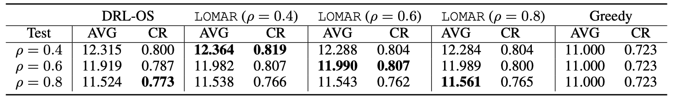
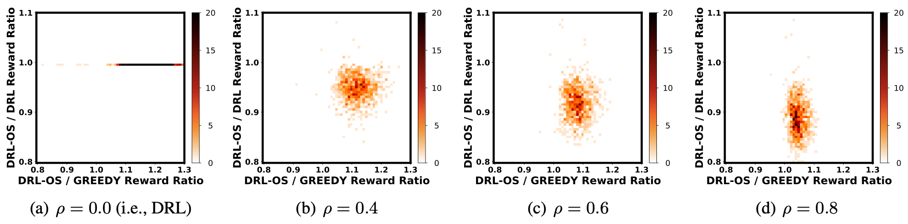

# Learning for Edge-Weighted Online Bipartite Matching with Robustness Guarantees

[](LICENSE.md)

[Pengfei Li](https://www.cs.ucr.edu/~pli081/), [Jianyi Yang](https://jyang-ai.github.io/) and [Shaolei Ren](https://intra.ece.ucr.edu/~sren/)

**Note**

This is the official implementation of the ICML 2023 paper 

## Requirements

* python>=3.6

## Installation
* Clone this repo:
```bash
git clone git@github.com:Ren-Research/LOMAR.git
cd LOMAR
```
Then please refer to [the install guide](INSTALL.md) for more details about installation

## Usage 
To apply our algorithm (LOMAR) in online bipartite matching, you need three main steps

1. Generate graph dataset
2. Train the RL model
3. Evaluate the policy

A script example for each step can be found in our brief [tutorial](TUTORIAL.md).

## Evaluation

In our experiment, we set $u_0 = 10$ and $v_0 = 60$ to generate the training and testing datasets. The number of graph instances in the training and testing datasets are 20000 and 1000, respectively. For the sake of reproducibility and fair comparision, our settings follows the same setup of our [baseline](https://github.com/lyeskhalil/CORL). 

|  |
|:--:|
| Table 1: Comparison under different $\rho$. In the top, LOMAR ($\rho = x$) means LOMAR is trained with the value of $\rho = x$. The average reward and competitive ratio are represented by AVG and CR, respectively — the higher, the better. The highest value in each testing setup is highlighted in bold. The AVG and CR for DRL are <b> 12.909 </b> and <b>0.544 </b> respectively. The average reward for OPT is <b> 13.209 </b> .|

The histogram of the bi-competitive ratios are visualized below. When $\rho = 0$, the ratio of DRL-OS / DRL is always 1 unsurprisingly. With a large $\rho$ (e.g. 0.8) for testing, the reward ratios of DRL-OS/Greedy for most samples are around 1, but the flexibility of DRL-OS is limited and can less exploit the good average performance of DRL. 

|  |
|:--:|
| Figure 1: Histogram of bi-competitive reward ratios of DRL-OS against Greedy and DRL under different $\rho$. The DRL-OS has the same online switching algorithm as LOMAR, while the RL model is trained with $\rho=0$. |

## Citation
```BibTex
    @inproceedings{Li2023LOMAR,
        title={Learning for Edge-Weighted Online Bipartite Matching with Robustness Guarantees},
        author={Li, Pengfei and Yang, Jianyi and Ren, Shaolei},
        booktitle={International Conference on Machine Learning},
        year={2023},
        organization={PMLR}
    }
```


## Codebase
Thanks for the code base from Mohammad Ali Alomrani, Reza Moravej, Elias B. Khalil. The public repository of their code is available at [https://github.com/lyeskhalil/CORL](https://github.com/lyeskhalil/CORL)


